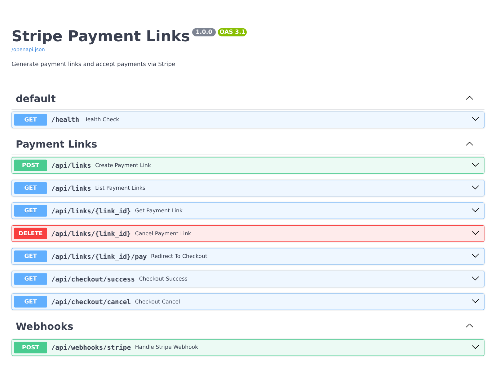
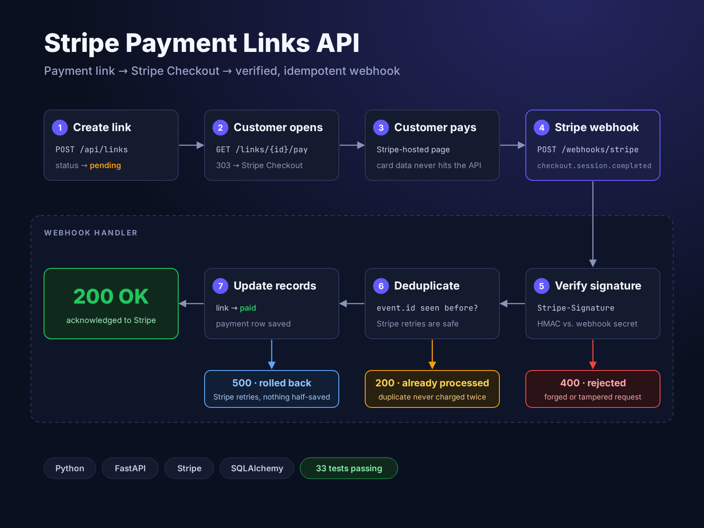
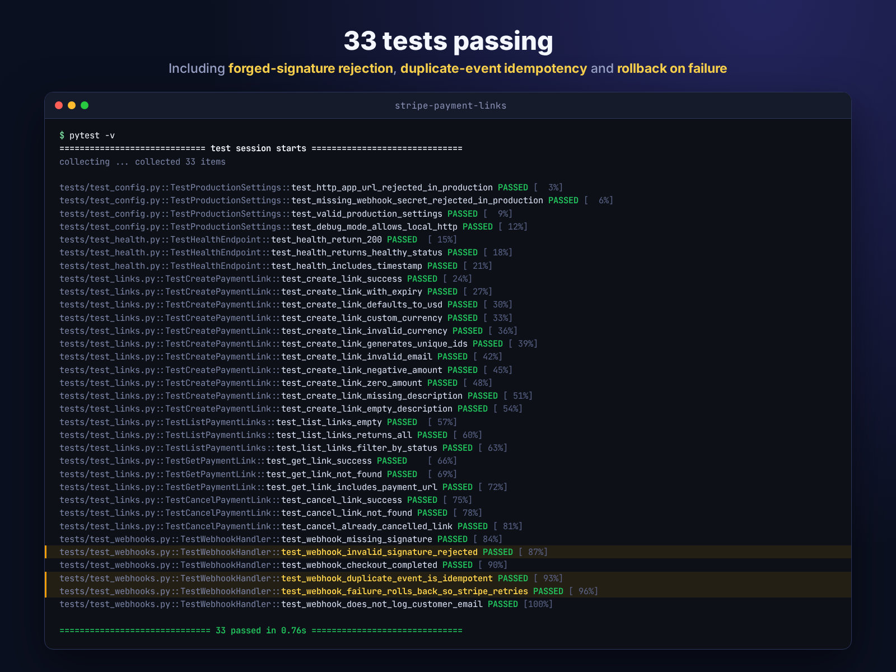

# Stripe Payment Links — REST API

[](https://www.python.org/)
[](https://fastapi.tiangolo.com/)
[](https://stripe.com/)
[](https://www.sqlalchemy.org/)
[](#)
[](LICENSE)

---

> **This is a product showcase repository.** It contains documentation and architecture for a Stripe Payment Links REST API developed by [ByteUp LLC](https://byteup.co). The source code is not included. For licensing inquiries, see [Licensing](#licensing) below.

## About

A REST API for generating and managing payment links with Stripe Checkout integration. Create shareable payment links programmatically, send them to customers, track payment status through webhooks, and handle Stripe's event lifecycle safely with idempotent duplicate detection.

Built with FastAPI, SQLAlchemy 2.0, and Pydantic — a clean, modular reference implementation of Stripe webhook handling done right.

## Features

- **Payment Link Generation** — Create unique Stripe payment links with custom amounts, currencies, and descriptions
- **Stripe Checkout Integration** — Redirect customers to Stripe's hosted payment page
- **Idempotent Webhook Processing** — Duplicate event detection prevents double-processing of Stripe webhooks
- **Signature Verification** — Stripe webhook signatures verified on every inbound event
- **Link Management** — Full CRUD: list, view, cancel payment links
- **Expiration Support** — Optional time-limited offers; expired links are marked and refused at checkout
- **Interactive API Docs** — Swagger UI and ReDoc out of the box (FastAPI)

## Architecture

Clean separation of concerns following FastAPI best practices.

```
app/
├── main.py          # FastAPI application entry point
├── config.py        # Pydantic Settings (typed env vars)
├── database.py      # SQLAlchemy 2.0 engine and session
├── models.py        # Declarative ORM models
├── schemas.py       # Pydantic request/response schemas
└── routes/
    ├── links.py     # Payment link CRUD endpoints
    └── webhooks.py  # Stripe webhook handler
```

**Why this structure:** Each layer has exactly one responsibility. Routes receive their database session through FastAPI dependency injection, so tests swap in an isolated database without touching route code. Schemas are never reused as ORM models. Configuration is typed and validated at startup, not sprinkled through `os.getenv()` calls across the codebase.

## Tech Stack

| Category       | Technology                            |
| -------------- | ------------------------------------- |
| Language       | Python 3.10+                          |
| Web Framework  | FastAPI 0.109 (async)                 |
| ORM            | SQLAlchemy 2.0 (modern declarative)   |
| Validation     | Pydantic v2                           |
| Configuration  | pydantic-settings                     |
| Database       | SQLite (dev) / PostgreSQL (prod)      |
| Payments       | Stripe Python SDK 7.10                |
| Testing        | pytest, httpx TestClient              |
| Docs           | Swagger UI, ReDoc (auto-generated)    |

## Engineering Highlights

### Idempotent Webhook Handling

Stripe guarantees **at-least-once delivery** for webhooks — the same event may be delivered multiple times. Naive implementations process the same `payment_intent.succeeded` event twice, updating the database twice, charging credits twice, sending two confirmation emails.

This API detects duplicates by persisting each processed event's ID:

1. Receive webhook, verify Stripe signature with `STRIPE_WEBHOOK_SECRET`
2. Check if `event.id` already exists in the `webhook_events` table
3. If yes → return `200 OK` immediately, skip processing (idempotent replay)
4. If no → process the event and record `event.id` in the same transaction
5. If processing fails → the transaction rolls back, the API returns `500`, and Stripe retries later
6. If two deliveries of the same event race → the unique constraint on `event.id` rejects the second, which is acknowledged as a duplicate

**Result:** Stripe can retry any webhook an unlimited number of times without side effects. Payment status updates are exactly-once from the application's perspective.

### Stripe Signature Verification

Every inbound webhook request is verified against the Stripe webhook signing secret before any business logic runs:

```python
try:
    event = stripe.Webhook.construct_event(
        payload=await request.body(),
        sig_header=request.headers["stripe-signature"],
        secret=settings.stripe_webhook_secret,
    )
except stripe.error.SignatureVerificationError:
    raise HTTPException(status_code=400, detail="Invalid signature")
```

This prevents attackers from forging webhook events against a publicly exposed `/api/webhooks/stripe` endpoint.

### Typed Configuration

All environment variables are loaded through `pydantic-settings`, validated at startup, and available as a typed `Settings` object throughout the app:

```python
class Settings(BaseSettings):
    stripe_secret_key: str
    stripe_publishable_key: str
    stripe_webhook_secret: str = ""
    app_url: str = "http://localhost:8000"
    debug: bool = False
    database_url: str = "sqlite:///./payments.db"

    model_config = SettingsConfigDict(env_file=".env", case_sensitive=False)

    @model_validator(mode="after")
    def check_production_settings(self):
        if self.debug:
            return self
        if not self.app_url.startswith("https://"):
            raise ValueError("APP_URL must use HTTPS when DEBUG is false")
        if not self.stripe_webhook_secret:
            raise ValueError("STRIPE_WEBHOOK_SECRET is required when DEBUG is false")
        return self
```

**Why it matters:** Missing or malformed env vars cause a startup failure with a clear error message, not a runtime `KeyError` three hours into production traffic. Outside debug mode, the app refuses to start without HTTPS and a webhook signing secret.

### Modular Route Structure

Routes are split into focused modules and mounted via FastAPI routers. Adding a new resource means adding a new router file — no changes to `main.py`, no sprawling route registry.

## API Reference



### Health Check

| Method | Endpoint  | Description             |
| ------ | --------- | ----------------------- |
| GET    | `/health` | Check API health status |

### Payment Links

| Method | Endpoint               | Description                          |
| ------ | ---------------------- | ------------------------------------ |
| POST   | `/api/links`           | Create a new payment link            |
| GET    | `/api/links`           | List all payment links               |
| GET    | `/api/links/{id}`      | Get a specific payment link          |
| DELETE | `/api/links/{id}`      | Cancel a payment link                |
| GET    | `/api/links/{id}/pay`  | Redirect to Stripe Checkout          |

### Webhooks

| Method | Endpoint                 | Description                       |
| ------ | ------------------------ | --------------------------------- |
| POST   | `/api/webhooks/stripe`   | Handle Stripe webhook events      |

### Example — Create a Payment Link

```bash
curl -X POST https://api.example.com/api/links \
  -H "Content-Type: application/json" \
  -d '{
    "amount": 50.00,
    "description": "Web consultation",
    "customer_email": "client@example.com"
  }'
```

**Response:**

```json
{
  "id": "abc-123-def",
  "amount": 50.0,
  "currency": "usd",
  "description": "Web consultation",
  "customer_email": "client@example.com",
  "status": "pending",
  "payment_url": "https://api.example.com/api/links/abc-123-def/pay",
  "created_at": "2026-01-28T00:00:00",
  "expires_at": null
}
```

## Payment Flow



## Security

- **Webhook signature verification** — every inbound webhook verified against `STRIPE_WEBHOOK_SECRET` before processing
- **Credentials loaded from environment** — no API keys in source or logs, loaded via `pydantic-settings`
- **Idempotent event processing** — duplicate Stripe events detected by event ID, never re-processed
- **Database parameterization** — all queries go through SQLAlchemy ORM, no raw SQL string interpolation
- **HTTPS-only in production** — APP_URL enforced as HTTPS in non-debug mode
- **No sensitive data logged** — logs carry payment link IDs only; no amounts, emails or other customer data

## Testing



```bash
# Full suite
pytest

# With coverage
pytest --cov=app

# Test the webhook signature verification specifically
pytest tests/test_webhooks.py -v
```

Test coverage focuses on:

- Payment link CRUD operations
- Stripe API client mocking (no live API calls in tests)
- Webhook signature verification (valid and forged signatures)
- Idempotent event processing (duplicate event detection)
- Database transaction rollback on failure, with Stripe retry
- Production settings validation (HTTPS and webhook secret required)
- No customer PII in logs

## Environment Variables

| Variable                  | Description                          | Required       |
| ------------------------- | ------------------------------------ | -------------- |
| `STRIPE_SECRET_KEY`       | Stripe secret API key                | Yes            |
| `STRIPE_PUBLISHABLE_KEY`  | Stripe publishable API key           | Yes            |
| `STRIPE_WEBHOOK_SECRET`   | Stripe webhook signing secret        | Yes (prod)     |
| `APP_URL`                 | Base URL of your application         | Yes            |
| `DATABASE_URL`            | Database connection string           | No (SQLite default) |
| `DEBUG`                   | Enable debug mode                    | No (default: false)         |

## Skills Demonstrated

| Area                 | Details                                                                    |
| -------------------- | -------------------------------------------------------------------------- |
| API Design           | RESTful conventions, FastAPI, typed request/response with Pydantic        |
| Payment Integration  | Stripe Checkout, webhook handling, signature verification                 |
| Idempotency          | At-least-once event handling with duplicate detection                     |
| ORM & Database       | SQLAlchemy 2.0, declarative models, transaction management                |
| Configuration        | Typed settings with pydantic-settings, startup validation                 |
| Security             | Webhook signature verification, credential isolation, HTTPS enforcement   |
| Testing              | pytest, API client mocking, webhook fixture testing                       |
| Documentation        | Auto-generated OpenAPI/Swagger, structured READMEs                        |

## About ByteUp

This API is a product of **[ByteUp LLC](https://byteup.co)**, a software studio building SaaS products for underserved markets and delivering contract development for clients who value clean architecture and reliable code.

### ByteUp products

| Product                   | Status             | Link                                                                                   |
| ------------------------- | ------------------ | -------------------------------------------------------------------------------------- |
| **Migratex**              | Production-ready   | [migratex-showcase](https://github.com/ivansing/migratex-showcase) — Excel → PostgreSQL ETL CLI |
| **Stripe Payment Links**  | Production-ready   | You are here                                                                           |
| **TroveTrends**           | Live               | [trovetrends.com](https://trovetrends.com)                                             |
| **FixDoc**                | In development     | `fixdoc.co` *(launching soon)* — live demo available on request                        |

### Author

Built and maintained by **Ivan Duarte**, Full-Stack Software Engineer and founder of ByteUp LLC. Based in Bogotá, Colombia.

- Company: [byteup.co](https://byteup.co) · contact@byteup.co
- GitHub: [@ivansing](https://github.com/ivansing)
- LinkedIn: [lance-dev](https://linkedin.com/in/lance-dev)

## Licensing

This REST API is proprietary software developed by ByteUp LLC. The source code is not included in this repository and is not available under any open-source license.

This repository contains documentation and marketing materials only. The content (README, architecture documentation, diagrams) is provided for informational and portfolio purposes.

For commercial licensing, integration consulting, or custom payment API development, contact **contact@byteup.co**.

---

*Document Version: 1.0 · Product: Stripe Payment Links REST API · Status: Production-Ready*
